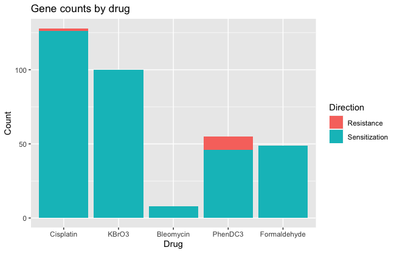
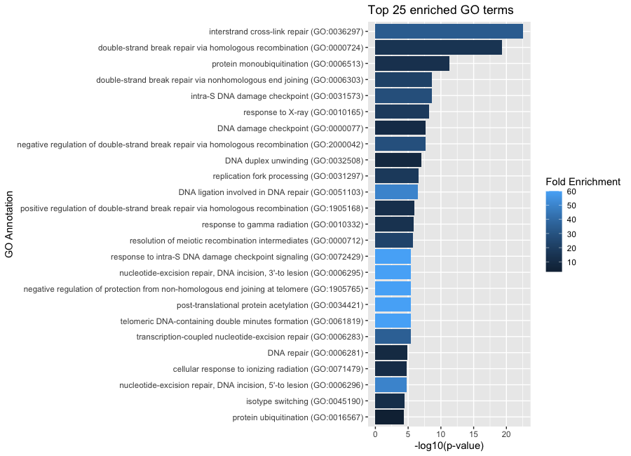

# Report for Lunenfeld-Tanenbaum Research Institute Interview Assignment

## Table of contents
1. [Overview](#overview)
   1. [Repository Description](#repository)
   2. [Script Description](#script)
2. [Dependencies](#dependencies)
3. [Output](#output)
   1. [Gene Scores](#out1)
   2. [Visualizations](#out2)
4. [Results & Interpretations](#results)
5. [References](#references)

## Overview 
Provided in this report is the solution to the technical assignment for the Bioinformatics position with the Durocher lab at Lunenfeld-Tanenbaum Research Institute with Mount Sinai.  
  
### Repository Description 
The associated GitHub repository includes the following files:  
- **README.md**: markdown file describing the assignment as provided via email  
- **Test_readcount.txt**: tab delimited CRISPR screen read counts as [provided](https://www.dropbox.com/s/75mm5xgqf7x5w4s/Test_readcount.txt?dl=0)  
- **pairwise_drugz_results.sh**: shell script using loop to iterate each pairwise comparison of Control (untreated) with Drug Condition using drugZ.py as statistical algorithm for analysis of CRISPR screens  
- **Results**: Folder with files of drugZ results for each drug treatment of interest  
- **gene_scores_visualization.R**: R script to solve required components of assignment (constructing gene scores file, visualizations, analysis)  
- **Test_gene_scores.txt**: tab delimited results describing gene score from normZ value for each drug treatment  
- **FDR_negative.txt**: tab delimited results describing FDR values for negative Z-score values  
- **FDR_positive.txt**: tab delimited results describing FDR values for positive Z-score values  
- **TG_results_BP.Rdata**: Table in Rdata format with results from Biological Process analysis for GO enrichment using topGO package  
- **gene_count_barplot.png**: figure visualizing genes significant for sensitization or resistance based on analysis of Z-scores and FDR  
- **top25_go_plot.png**: figure visualizing enriched GO terms with most significant p-values and associated fold-change  
- **Test_report_submission.md**: this report in markdown format  
Both scripts, both figures, and the Test_gene_scores.txt file are also included with this submission as separate files for convenience.  
  
### Script Description 
The script *pairwise_drugz_results.sh* uses the drugz.py algorithm to analyze drug/gene interactions of CRISPR screens. Each pairwise comparison of untreated/treated has a corresponding results file in the Results folder.  
  
The *gene_scores_visualization.R* script is structured in six sections. The first part loads all required libraries. The second part imports the results from the drugZ analysis and inspects the data for outliers and potential problems. Part three produces the required output of gene-level scores for each drug treatment, as well as tables of the corresponding FDR values for negative and positive Z-scores for use downstream. Part four identifies which genes from the analysis should be considered significant based on Z-score and FDR values as determined by reference to previous work. Part five uses the R package topGO to determine which GO terms within the biological processes ontology are enriched within the significant genes relative to all genes considered with the [TKOv3 library](https://www.addgene.org/pooled-library/moffat-crispr-knockout-tkov3/). The final part of the script uses ggplot2 to construct figures to visualize the results of the analysis.  
  
## Dependencies 
The CRISPR screen analysis in the *pairwise_drugz_results.sh* script was done using [DrugZ](https://github.com/hart-lab/drugz).  
The following packages were imported for use in the R script, gene_scores_visualization.R:  
- plyr (v 1.8.6): "plyr" is used for mapping values from drug-specific results tables to gene score table for all drugs  
- biomaRt (v 2.46.3): "biomaRt" is used to construct an annotation table of genes and associated GO terms from Ensembl databases  
- topGO (v 2.42.0): "topGO" is used to determine enrichment of GO terms within significant genes set  
- reshape2 (v 1.4.4): "reshape2" is used to restructure wide form dataframes into long form for ease of use with plotting functions  
- ggplot2 (v 3.3.5): "ggplot2" is used for constructing figures  
  
## Output 
The two requested outputs are a tab delimited file of gene-level scores for each untreated vs. drug-treated comparison, and a concise visualization to represent the output. Provided here are descriptions for each of the output files requested in the assignment. Other output files in this repository serve as documentation, version control, and quality checks.  
  
### Gene Scores 
The file *Test_gene_scores.txt* uses the normZ value from each of the pairwise untreated vs. drug-treated drugZ results files. This file will be attached to the submission email for convenience.  
  
### Visualizations 
The output to the second part of the assignment includes a concise visualization of the resulting gene scores. Visualizations were constructed based on gene-drug interactions that were considered significant in accordance with the statistical parameters used in the publication *A Genetic Map of the Response to DNA Damage in Human Cells* (2020, Olivieri et al.). Specifically, due to the calibration of the drugZ algorithm to cell population sensitization to chemotoxic agents, an asymmetric set of parameters for significance was selected. Genes were considered significant in sensitivity if the Z-score was less than -3 and FDR was less than 15%. Genes were considered significant for resistance if the Z-score was greater than 6, and FDR was less than 0.01.  
  
## Results & Interpretations 
The resulting number of significant gene-drug interactions indicated 273 significant genes, with 262 being sensitized, and 11 having resistance (**Fig.1**). The referenced publication cites "864 genes whose loss led to sensitization and 58 genes whose mutation led to resistance", which is a similar distribution to this analysis of a sample test dataset, as both indicate that greater than 90% of the significant genes identified are sensitized. This is expected, as a chemotoxic agent can be expected to disrupt cellular genes essential to survival.  
  
|  |
| :-- |
| <b>Fig.1:</b> Number of genes significant for sensitivity and resistance for each drug treatment relative to untreated cells. |
  
The significant genes were analyzed for biological process gene ontology patterns. The top 25 terms are shown below (**Fig.2**), based on p-value as calculated using topGO's weighted algorithm with Fisher test statistic. The fold-change was calculated as the number of time the term appeared in significant genes divided by the expected number of times that the term would appear in a random sample of the same number of genes extracted from the given background set of genes. The background set of genes provided was derived from the complete list of genes in the results files. 
  
|  |
| :-- |
| <b>Fig.2:</b> Enriched GO terms for biological processes. The top 25 terms based on p-value as calculated using topGO's weighted algorithm with Fisher test statistic. The fold-change was calculated as the number of time the term appeared in significant genes divided by the expected number of times that the term would appear in a random sample of the same number of genes extracted from the given background set of genes. |
  
As can be seen in **Fig.2**, and the complete topGO results file (*TG_results_BP.Rdata*), there is an abundance of terms associated with DNA damage repair represented in the enriched GO terms of genes impacted by the chemotoxic agents used to treat cells. These findings are in agreement with the referenced publication.  
  
## Referenes 
Olivieri, M., Cho, T., Álvarez-Quilón, A., Li, K., Schellenberg, M. J., Zimmermann, M., Hustedt, N., Rossi, S. E., Adam, S., Melo, H., Heijink, A. M., Sastre-Moreno, G., Moatti, N., Szilard, R. K., McEwan, A., Ling, A. K., Serrano-Benitez, A., Ubhi, T., Feng, S., … Durocher, D. (2020). A Genetic Map of the Response to DNA Damage in Human Cells. Cell, 182(2), 481-496.e21. https://doi.org/10.1016/j.cell.2020.05.040